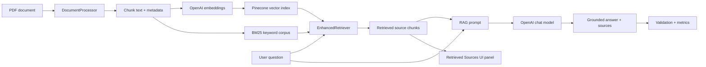

# PDF Chatbot RAG Demo


A production-style Retrieval-Augmented Generation application for asking questions over PDF documents. The project demonstrates document ingestion, chunking, semantic retrieval, optional hybrid BM25 retrieval, grounded answer generation, source transparency, validation, observability, and containerized deployment.

## Why This Project Matters

Most RAG demos stop at "embed a document and ask a question." This one is designed to show the pieces that make a RAG system trustworthy and operable:

- **Grounded answers**: The model is instructed to answer only from retrieved PDF context.
- **Inspectable retrieval**: Each answer can expose the source chunks and retrieval settings used to generate it.
- **Hybrid search**: Pinecone vector retrieval can be combined with BM25 keyword retrieval for better recall.
- **Source metadata**: Chunks preserve source and page metadata so answers can cite where evidence came from.
- **Guardrails**: Empty retrieval results return a grounded fallback instead of asking the LLM to guess.
- **Validation path**: Optional structured hallucination checks flag unsupported claims.
- **Observability**: Prometheus metrics track latency, retrievals, LLM calls, token usage, cache behavior, hallucination confidence, and user feedback.
- **Deployable demo**: Docker, Kubernetes manifests, Prometheus, and Grafana are included.

## Architecture



## Core Features

| Area | What it shows |
| --- | --- |
| Ingestion | Loads PDFs, splits pages into overlapping chunks, and stores document metadata. |
| Retrieval | Uses semantic vector search with optional BM25 keyword retrieval and configurable weighting. |
| Generation | Builds a source-aware RAG prompt and generates answers from retrieved context. |
| Transparency | Displays retrieved snippets, source metadata, page information, and active retrieval settings. |
| Guardrails | Handles empty retrievals with a grounded fallback and supports hallucination checks. |
| Operations | Ships with Docker, Kubernetes manifests, Prometheus metrics, and Grafana dashboards. |
| Testing | Includes offline unit tests using fake LLM and vector-store components. |

## Tech Stack

- **Frontend**: Streamlit chat UI
- **LLM**: OpenAI chat models via LangChain
- **Embeddings**: OpenAI embeddings
- **Vector database**: Pinecone
- **Keyword retrieval**: BM25
- **Monitoring**: Prometheus and Grafana
- **Deployment**: Docker, Docker Compose, Kubernetes, Minikube
- **Tests**: Python `unittest` with fakes for offline execution

## Quick Start

### 1. Create a Pinecone index

Create an index in the Pinecone UI:

- Dimension: `1536`
- Metric: `cosine`
- Name: any value you will reuse as `PINECONE_INDEX_NAME`

### 2. Configure environment variables

```bash
cp .env.example .env
```

Then fill in:

```bash
OPENAI_API_KEY=your_openai_api_key
PINECONE_API_KEY=your_pinecone_api_key
PINECONE_ENVIRONMENT=us-east-1
PINECONE_INDEX_NAME=your_pinecone_index
```

### 3. Install dependencies

```bash
python -m venv venv
source venv/bin/activate
pip install -r requirements.txt
```

### 4. Run the Streamlit app

```bash
streamlit run streamlit_app.py
```

The app runs at [http://localhost:8501](http://localhost:8501).

## Deploy With Minikube

```bash
minikube start --memory=4096 --cpus=4
eval $(minikube docker-env)
./deploy.sh
```

After deployment:

| Service | URL |
| --- | --- |
| Streamlit app | http://localhost:8501 |
| Prometheus | http://localhost:9090 |
| Grafana | http://localhost:3000 |
| Raw metrics | http://localhost:8099/metrics |

Set `SKIP_INIT_JOB=true` if the Pinecone index is already populated and you want to skip PDF processing.

## Testing

The core tests run without OpenAI, Pinecone, or network access:

```bash
python -m unittest discover -s tests
```

These tests validate the RAG contract:

- Runtime retrieval options are applied.
- Retrieved source metadata is preserved.
- Empty retrieval returns a grounded fallback.
- BM25 chunk export/import preserves metadata.

## Project Structure

```text
app/                 Streamlit app and chat UI
core/                RAG service, retrieval, LLM provider, validation
data/                PDF processing, vector loading, Pinecone wrapper
monitoring/          Prometheus metrics
k8s/                 Kubernetes deployment and monitoring manifests
docs/                Implementation review and improvement notes
tests/               Offline unit tests for the RAG contract
```

## What I Would Improve Next

- Add a small evaluation dataset with expected answers and cited pages.
- Add a local vector-store mode so reviewers can run the demo without Pinecone.
- Add PDF upload and multi-document selection.
- Add screenshots or a short GIF showing the retrieved-sources panel.
- Modernize the Pinecone initialization path if the project upgrades fully to the latest SDK.

## Resume Talking Points

- Built an end-to-end RAG application over PDFs using OpenAI, Pinecone, LangChain, and Streamlit.
- Implemented hybrid semantic and keyword retrieval with source metadata preservation.
- Added grounding guardrails, retrieval transparency, and optional hallucination validation.
- Containerized the app and included Kubernetes, Prometheus, and Grafana for production-style deployment.
- Added offline unit tests around core RAG behavior so the project is reviewable without external services.

## Cleanup

```bash
./cleanup.sh
```

To delete Kubernetes resources manually:

```bash
kubectl delete -f k8s/deployment.yaml
kubectl delete -f k8s/service.yaml
kubectl delete -f k8s/prometheus.yaml
kubectl delete -f k8s/grafana.yaml
```

See [docs/rag_review.md](docs/rag_review.md) for the implementation review, flaws found, fixes made, and recommended next improvements.
